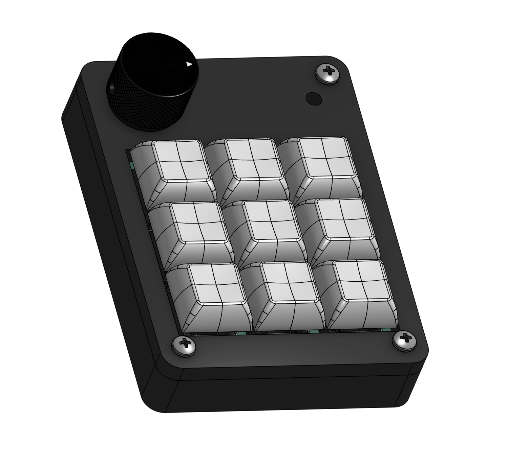
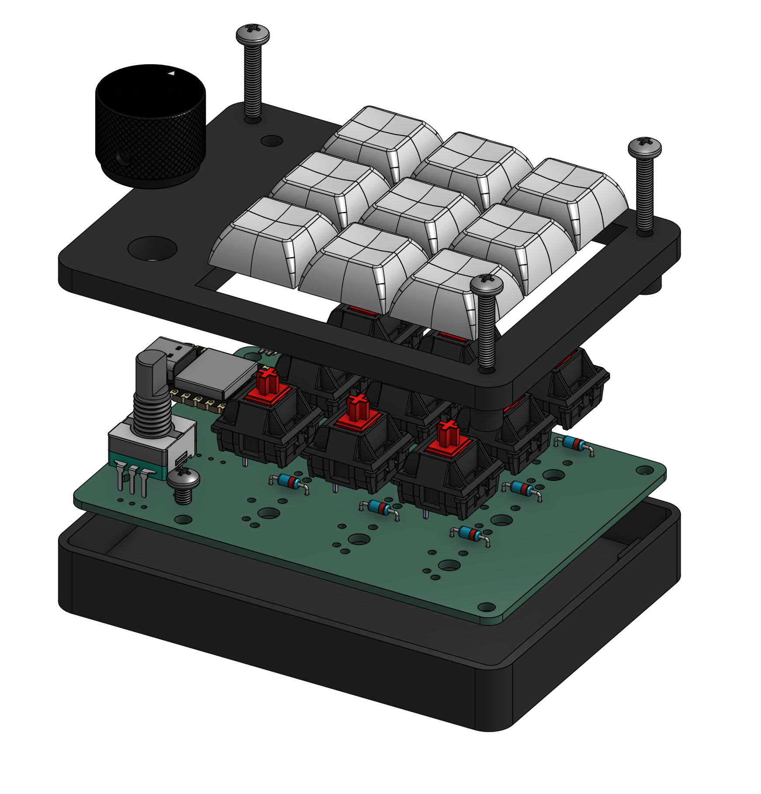
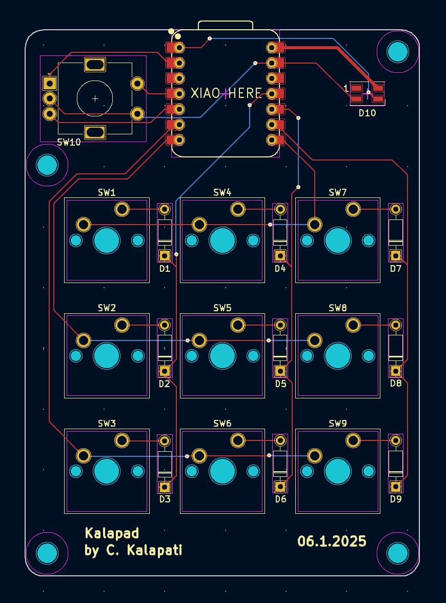
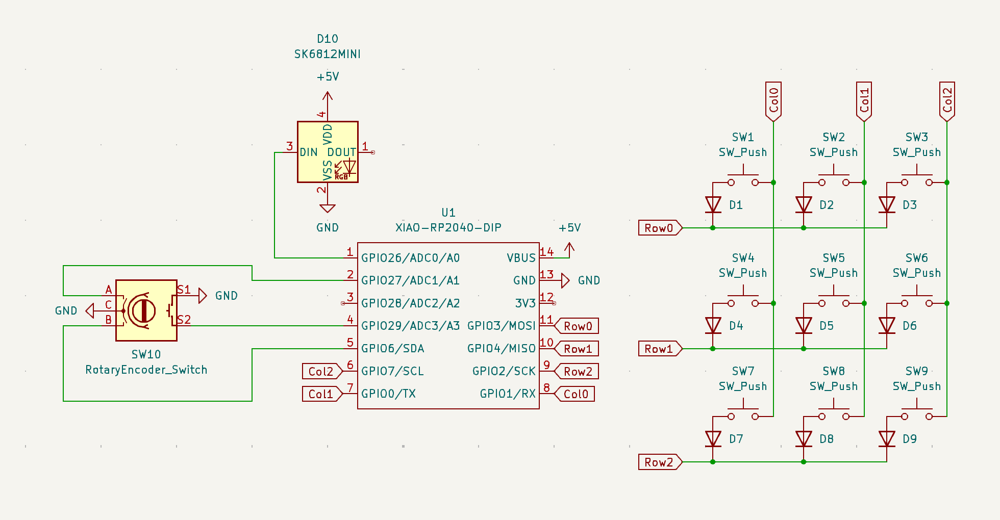

# Kalapad

*A custom QMK-based 9 key macropad*

## Features

- Cherry MX Switch compatibility
- SK6812-E RGB LED indicator light
- EC11 Rotary Encoder for volume control
- Matrix-style switch layout

## Design

### PCB

### Schematic 

## BOM

- 9x Cherry MX Switches
- 1x SK6812-E LED
- 1x EC11 Rotary Encoder
- 1x Seeed Studio XIAO RP2040
- 3x M3x16mm screws
- 1x 3D-Printed Case (Top and Bottom)

Optionally if desired, there is an extra screw hole on the top left for a M3x4mm screw. Kalapad can be safely mounted and used without it though.